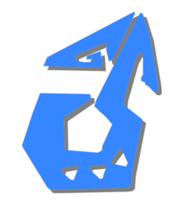

# Faces
{: .text-yellow-300 .fw-500 .fs-8 .lh-default .no_toc }

|  Female |  Male | 
{: .text-yellow-300 .fw-700 .text-center }

---

### Female
{: .text-yellow-300 .fw-700 }

|  |  |  |  |
|:---:|:---:|:---:|:---:|
| f_face000.pac 0374 | f_face001.pac 0375 | f_face002.pac 0376 | f_face003.pac 0377 |
|  |  |  |  |
| f_face004.pac 0378 | f_face005.pac 0379 | f_face006.pac 0380 | f_face007.pac 0381 |
|  |  |  |  |
| f_face008.pac 0382 | f_face009.pac 0383 | f_face010.pac 0384 | f_face011.pac 0385 |
|  |  |  |  |
| f_face012.pac 0386 | f_face013.pac 0387 | f_face014.pac 0388 | f_face015.pac 0389 |
|  |  |  |  |
| f_face016.pac 0390 | f_face017.pac 0391 | f_face018.pac 0392 | f_face019.pac 0393 |
|  |  |  |  |
| f_face020.pac 0394 | f_face021.pac 0395 | f_face022.pac 0396 | f_face023.pac 0397 |
|  |  |  |  |
| f_face024.pac 0398 | f_face025.pac 0399 | f_face026.pac 0400 | f_face027.pac 0401 |
|  |  |  |  |
| f_face028.pac 0402 | f_face029.pac 0403 | f_face030.pac 0404 | f_face031.pac 0405 |

### Male
{: .text-yellow-300 .fw-700 }

|  |  |  |  |
|:---:|:---:|:---:|:---:|
| m_face000.pac 2027 | m_face001.pac 2028 | m_face002.pac 2029 | m_face003.pac 2030 |
|  |  |  |  |
| m_face004.pac 2031 | m_face005.pac 2032 | m_face006.pac 2033 | m_face007.pac 2034 |
|  |  |  |  |
| m_face008.pac 2035 | m_face009.pac 2036 | m_face010.pac 2037 | m_face011.pac 2038 |
|  |  |  |  |
| m_face012.pac 2039 | m_face013.pac 2040 | m_face014.pac 2041 | m_face015.pac 2042 |
|  |  |  |  |
| m_face016.pac 2043 | m_face017.pac 2044 | m_face018.pac 2045 | m_face019.pac 2046 |
|  |  |  |  |
| m_face020.pac 2047 | m_face021.pac 2048 | m_face022.pac 2049 | m_face023.pac 2050 |
|  |  |  |  |
| m_face024.pac 2051 | m_face025.pac 2052 | m_face026.pac 2053 | m_face027.pac 2054 |
|  |  |  |  |
| m_face028.pac 2055 | m_face029.pac 2056 | m_face030.pac 2057 | m_face031.pac 2058 |
