# Outfits
{: .text-yellow-300 .fw-500 .fs-8 .lh-default .no_toc }

Outfits are broken up into individual "armor" pieces and are only shown when nothing is equipped or using a armor with no model (like the chakra pieces).

To see what files associate with a given outfit, select the gender and then the outfit type.

{: .note }
These are different from the character create player model... If you wish to modify the character create model, they are at `edit/editpl_f.pac` and `edit/editpl_m.pac` for female/male respectively.

{: .note }
There's no `Head` section because the "Head" is just the combination of face and hair.

|  Female |  Male | 
{: .text-yellow-300 .fw-700 .text-center }

---

### Female
{: .text-yellow-300 .fw-700 }

| [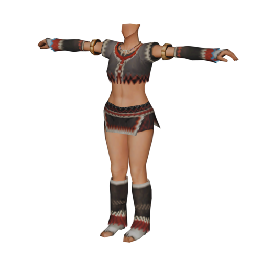](#type-1) | [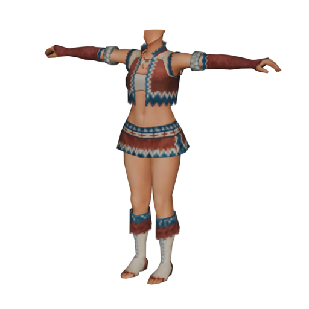](#type-2) | [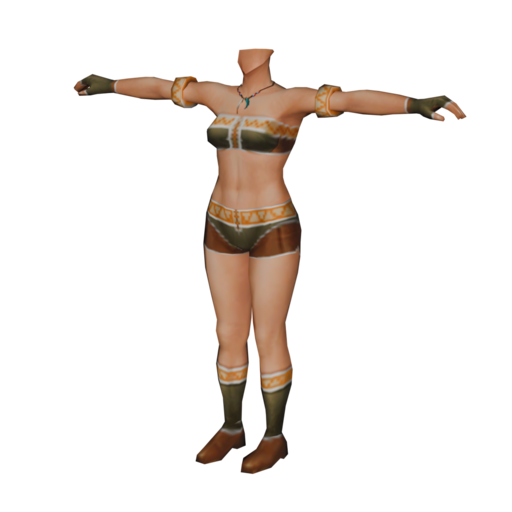](#type-3) | [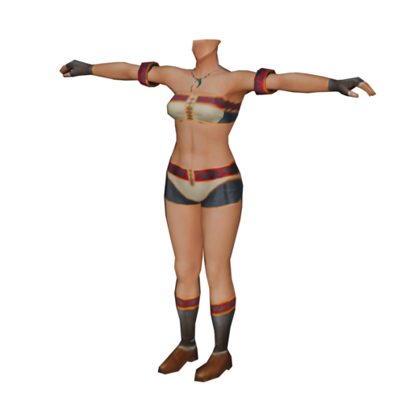](#type-4) |
|:---:|:---:|:---:|:---:|
| [Type 1](#type-1) | [Type 2](#type-2) | [Type 3](#type-3) | [Type 4](#type-4) |
| [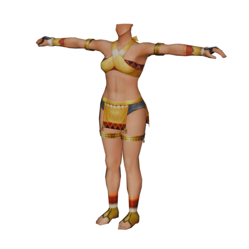](#type-5) | [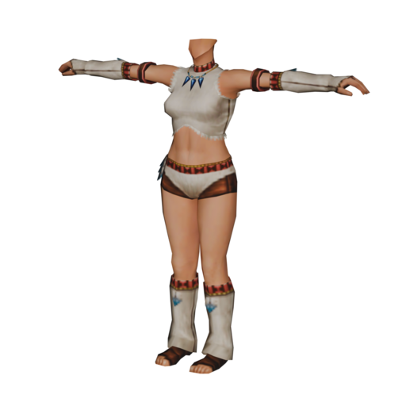](#type-6) | [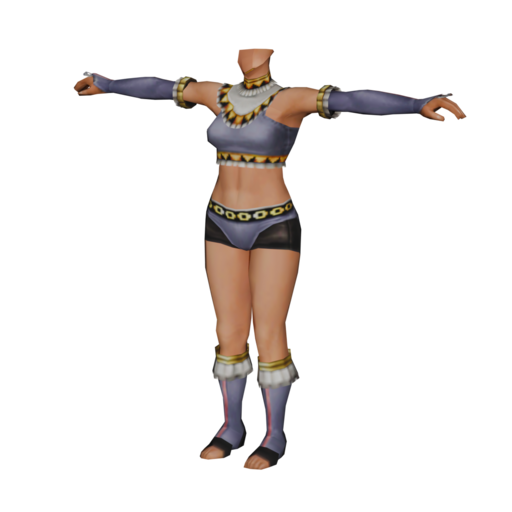](#type-7) | [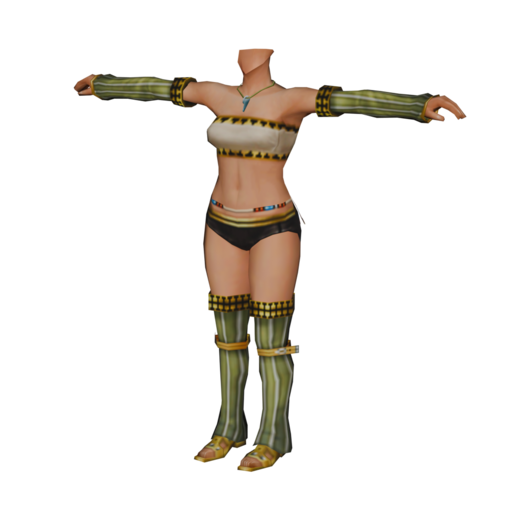](#type-8) |
| [Type 5](#type-5) | [Type 6](#type-6) | [Type 7](#type-7) | [Type 8](#type-8) |

### Type 1
{: .text-yellow-300 .fw-700 .text-center }

<table>
    
    <thead>
    <tr>
        <th style="color:#ffeb82;" colspan="3">Skin Type 1</th>
        <th style="color:#ffeb82;" colspan="3">Skin Type 2</th>
    </tr>
    </thead>
    <tbody>
    <tr>
        <th style="color:#ffeb82;">Type</th>
        <th style="color:#ffeb82;">File ID</th>
        <th style="color:#ffeb82;">File Name</th>
        <th style="color:#ffeb82;">Type</th>
        <th style="color:#ffeb82;">File ID</th>
        <th style="color:#ffeb82;">File Name</th>
    </tr>
    <tr>
        <td>Chest</td>
        <td>0934</td>
        <td>f_body188.pac</td>
        <td>Chest</td>
        <td>0935</td>
        <td>f_body189.pac</td>
    </tr>
    <tr>
        <td>Arm</td>
        <td>1</td>
        <td>.pac</td>
        <td>Arm</td>
        <td>1</td>
        <td>.pac</td>
    </tr>
    <tr>
        <td>Leg</td>
        <td>1</td>
        <td>.pac</td>
        <td>Leg</td>
        <td>1</td>
        <td>.pac</td>
    </tr>
    <tr>
        <th style="color:#ffeb82;" colspan="3">Skin Type 3</th>
        <th style="color:#ffeb82;" colspan="3">Skin Type 4</th>
    </tr>
    <tr>
        <th style="color:#ffeb82;">Type</th>
        <th style="color:#ffeb82;">File ID</th>
        <th style="color:#ffeb82;">File Name</th>
        <th style="color:#ffeb82;">Type</th>
        <th style="color:#ffeb82;">File ID</th>
        <th style="color:#ffeb82;">File Name</th>
    </tr>
    <tr>
        <td>Chest</td>
        <td>0936</td>
        <td>f_body190.pac</td>
        <td>Chest</td>
        <td>0937</td>
        <td>f_body191.pac</td>
    </tr>
    <tr>
        <td>Arm</td>
        <td>1</td>
        <td>.pac</td>
        <td>Arm</td>
        <td>1</td>
        <td>.pac</td>
    </tr>
    <tr>
        <td>Leg</td>
        <td>1</td>
        <td>.pac</td>
        <td>Leg</td>
        <td>1</td>
        <td>.pac</td>
    </tr>
</tbody></table>

### Type 2
{: .text-yellow-300 .fw-700 .text-center }

<table>
    
    <thead>
    <tr>
        <th style="color:#ffeb82;" colspan="3">Skin Type 1</th>
        <th style="color:#ffeb82;" colspan="3">Skin Type 2</th>
    </tr>
    </thead>
    <tbody>
    <tr>
        <th style="color:#ffeb82;">Type</th>
        <th style="color:#ffeb82;">File ID</th>
        <th style="color:#ffeb82;">File Name</th>
        <th style="color:#ffeb82;">Type</th>
        <th style="color:#ffeb82;">File ID</th>
        <th style="color:#ffeb82;">File Name</th>
    </tr>
    <tr>
        <td>Chest</td>
        <td>0938</td>
        <td>f_body192.pac</td>
        <td>Chest</td>
        <td>0939</td>
        <td>f_body193.pac</td>
    </tr>
    <tr>
        <td>Arm</td>
        <td>1</td>
        <td>.pac</td>
        <td>Arm</td>
        <td>1</td>
        <td>.pac</td>
    </tr>
    <tr>
        <td>Leg</td>
        <td>1</td>
        <td>.pac</td>
        <td>Leg</td>
        <td>1</td>
        <td>.pac</td>
    </tr>
    <tr>
        <th style="color:#ffeb82;" colspan="3">Skin Type 3</th>
        <th style="color:#ffeb82;" colspan="3">Skin Type 4</th>
    </tr>
    <tr>
        <th style="color:#ffeb82;">Type</th>
        <th style="color:#ffeb82;">File ID</th>
        <th style="color:#ffeb82;">File Name</th>
        <th style="color:#ffeb82;">Type</th>
        <th style="color:#ffeb82;">File ID</th>
        <th style="color:#ffeb82;">File Name</th>
    </tr>
    <tr>
        <td>Chest</td>
        <td>0940</td>
        <td>f_body194.pac</td>
        <td>Chest</td>
        <td>0941</td>
        <td>f_body195.pac</td>
    </tr>
    <tr>
        <td>Arm</td>
        <td>1</td>
        <td>.pac</td>
        <td>Arm</td>
        <td>1</td>
        <td>.pac</td>
    </tr>
    <tr>
        <td>Leg</td>
        <td>1</td>
        <td>.pac</td>
        <td>Leg</td>
        <td>1</td>
        <td>.pac</td>
    </tr>
</tbody></table>

### Type 3
{: .text-yellow-300 .fw-700 .text-center }

<table>
    
    <thead>
    <tr>
        <th style="color:#ffeb82;" colspan="3">Skin Type 1</th>
        <th style="color:#ffeb82;" colspan="3">Skin Type 2</th>
    </tr>
    </thead>
    <tbody>
    <tr>
        <th style="color:#ffeb82;">Type</th>
        <th style="color:#ffeb82;">File ID</th>
        <th style="color:#ffeb82;">File Name</th>
        <th style="color:#ffeb82;">Type</th>
        <th style="color:#ffeb82;">File ID</th>
        <th style="color:#ffeb82;">File Name</th>
    </tr>
    <tr>
        <td>Chest</td>
        <td>0746</td>
        <td>f_body000.pac</td>
        <td>Chest</td>
        <td>0758</td>
        <td>f_body012.pac</td>
    </tr>
    <tr>
        <td>Arm</td>
        <td>1</td>
        <td>.pac</td>
        <td>Arm</td>
        <td>1</td>
        <td>.pac</td>
    </tr>
    <tr>
        <td>Leg</td>
        <td>1</td>
        <td>.pac</td>
        <td>Leg</td>
        <td>1</td>
        <td>.pac</td>
    </tr>
    <tr>
        <th style="color:#ffeb82;" colspan="3">Skin Type 3</th>
        <th style="color:#ffeb82;" colspan="3">Skin Type 4</th>
    </tr>
    <tr>
        <th style="color:#ffeb82;">Type</th>
        <th style="color:#ffeb82;">File ID</th>
        <th style="color:#ffeb82;">File Name</th>
        <th style="color:#ffeb82;">Type</th>
        <th style="color:#ffeb82;">File ID</th>
        <th style="color:#ffeb82;">File Name</th>
    </tr>
    <tr>
        <td>Chest</td>
        <td>0759</td>
        <td>f_body013.pac</td>
        <td>Chest</td>
        <td>0760</td>
        <td>f_body014.pac</td>
    </tr>
    <tr>
        <td>Arm</td>
        <td>1</td>
        <td>.pac</td>
        <td>Arm</td>
        <td>1</td>
        <td>.pac</td>
    </tr>
    <tr>
        <td>Leg</td>
        <td>1</td>
        <td>.pac</td>
        <td>Leg</td>
        <td>1</td>
        <td>.pac</td>
    </tr>
</tbody></table>

### Type 4
{: .text-yellow-300 .fw-700 .text-center }

<table>
    
    <thead>
    <tr>
        <th style="color:#ffeb82;" colspan="3">Skin Type 1</th>
        <th style="color:#ffeb82;" colspan="3">Skin Type 2</th>
    </tr>
    </thead>
    <tbody>
    <tr>
        <th style="color:#ffeb82;">Type</th>
        <th style="color:#ffeb82;">File ID</th>
        <th style="color:#ffeb82;">File Name</th>
        <th style="color:#ffeb82;">Type</th>
        <th style="color:#ffeb82;">File ID</th>
        <th style="color:#ffeb82;">File Name</th>
    </tr>
    <tr>
        <td>Chest</td>
        <td>0965</td>
        <td>f_body219.pac</td>
        <td>Chest</td>
        <td>0966</td>
        <td>f_body220.pac</td>
    </tr>
    <tr>
        <td>Arm</td>
        <td>1</td>
        <td>.pac</td>
        <td>Arm</td>
        <td>1</td>
        <td>.pac</td>
    </tr>
    <tr>
        <td>Leg</td>
        <td>1</td>
        <td>.pac</td>
        <td>Leg</td>
        <td>1</td>
        <td>.pac</td>
    </tr>
    <tr>
        <th style="color:#ffeb82;" colspan="3">Skin Type 3</th>
        <th style="color:#ffeb82;" colspan="3">Skin Type 4</th>
    </tr>
    <tr>
        <th style="color:#ffeb82;">Type</th>
        <th style="color:#ffeb82;">File ID</th>
        <th style="color:#ffeb82;">File Name</th>
        <th style="color:#ffeb82;">Type</th>
        <th style="color:#ffeb82;">File ID</th>
        <th style="color:#ffeb82;">File Name</th>
    </tr>
    <tr>
        <td>Chest</td>
        <td>0967</td>
        <td>f_body221.pac</td>
        <td>Chest</td>
        <td>0968</td>
        <td>f_body222.pac</td>
    </tr>
    <tr>
        <td>Arm</td>
        <td>1</td>
        <td>.pac</td>
        <td>Arm</td>
        <td>1</td>
        <td>.pac</td>
    </tr>
    <tr>
        <td>Leg</td>
        <td>1</td>
        <td>.pac</td>
        <td>Leg</td>
        <td>1</td>
        <td>.pac</td>
    </tr>
</tbody></table>

### Type 5
{: .text-yellow-300 .fw-700 .text-center }

<table>
    
    <thead>
    <tr>
        <th style="color:#ffeb82;" colspan="3">Skin Type 1</th>
        <th style="color:#ffeb82;" colspan="3">Skin Type 2</th>
    </tr>
    </thead>
    <tbody>
    <tr>
        <th style="color:#ffeb82;">Type</th>
        <th style="color:#ffeb82;">File ID</th>
        <th style="color:#ffeb82;">File Name</th>
        <th style="color:#ffeb82;">Type</th>
        <th style="color:#ffeb82;">File ID</th>
        <th style="color:#ffeb82;">File Name</th>
    </tr>
    <tr>
        <td>Chest</td>
        <td>0998</td>
        <td>f_body252.pac</td>
        <td>Chest</td>
        <td>0997</td>
        <td>f_body251.pac</td>
    </tr>
    <tr>
        <td>Arm</td>
        <td>1</td>
        <td>.pac</td>
        <td>Arm</td>
        <td>1</td>
        <td>.pac</td>
    </tr>
    <tr>
        <td>Leg</td>
        <td>1</td>
        <td>.pac</td>
        <td>Leg</td>
        <td>1</td>
        <td>.pac</td>
    </tr>
    <tr>
        <th style="color:#ffeb82;" colspan="3">Skin Type 3</th>
        <th style="color:#ffeb82;" colspan="3">Skin Type 4</th>
    </tr>
    <tr>
        <th style="color:#ffeb82;">Type</th>
        <th style="color:#ffeb82;">File ID</th>
        <th style="color:#ffeb82;">File Name</th>
        <th style="color:#ffeb82;">Type</th>
        <th style="color:#ffeb82;">File ID</th>
        <th style="color:#ffeb82;">File Name</th>
    </tr>
    <tr>
        <td>Chest</td>
        <td>0996</td>
        <td>f_body250.pac</td>
        <td>Chest</td>
        <td>0995</td>
        <td>f_body249.pac</td>
    </tr>
    <tr>
        <td>Arm</td>
        <td>1</td>
        <td>.pac</td>
        <td>Arm</td>
        <td>1</td>
        <td>.pac</td>
    </tr>
    <tr>
        <td>Leg</td>
        <td>1</td>
        <td>.pac</td>
        <td>Leg</td>
        <td>1</td>
        <td>.pac</td>
    </tr>
</tbody></table>

### Type 6
{: .text-yellow-300 .fw-700 .text-center }

<table>
    
    <thead>
    <tr>
        <th style="color:#ffeb82;" colspan="3">Skin Type 1</th>
        <th style="color:#ffeb82;" colspan="3">Skin Type 2</th>
    </tr>
    </thead>
    <tbody>
    <tr>
        <th style="color:#ffeb82;">Type</th>
        <th style="color:#ffeb82;">File ID</th>
        <th style="color:#ffeb82;">File Name</th>
        <th style="color:#ffeb82;">Type</th>
        <th style="color:#ffeb82;">File ID</th>
        <th style="color:#ffeb82;">File Name</th>
    </tr>
    <tr>
        <td>Chest</td>
        <td>1002</td>
        <td>f_body256.pac</td>
        <td>Chest</td>
        <td>1001</td>
        <td>f_body255.pac</td>
    </tr>
    <tr>
        <td>Arm</td>
        <td>1</td>
        <td>.pac</td>
        <td>Arm</td>
        <td>1</td>
        <td>.pac</td>
    </tr>
    <tr>
        <td>Leg</td>
        <td>1</td>
        <td>.pac</td>
        <td>Leg</td>
        <td>1</td>
        <td>.pac</td>
    </tr>
    <tr>
        <th style="color:#ffeb82;" colspan="3">Skin Type 3</th>
        <th style="color:#ffeb82;" colspan="3">Skin Type 4</th>
    </tr>
    <tr>
        <th style="color:#ffeb82;">Type</th>
        <th style="color:#ffeb82;">File ID</th>
        <th style="color:#ffeb82;">File Name</th>
        <th style="color:#ffeb82;">Type</th>
        <th style="color:#ffeb82;">File ID</th>
        <th style="color:#ffeb82;">File Name</th>
    </tr>
    <tr>
        <td>Chest</td>
        <td>1000</td>
        <td>f_body254.pac</td>
        <td>Chest</td>
        <td>0999</td>
        <td>f_body253.pac</td>
    </tr>
    <tr>
        <td>Arm</td>
        <td>1</td>
        <td>.pac</td>
        <td>Arm</td>
        <td>1</td>
        <td>.pac</td>
    </tr>
    <tr>
        <td>Leg</td>
        <td>1</td>
        <td>.pac</td>
        <td>Leg</td>
        <td>1</td>
        <td>.pac</td>
    </tr>
</tbody></table>

### Type 7
{: .text-yellow-300 .fw-700 .text-center }

<table>
    
    <thead>
    <tr>
        <th style="color:#ffeb82;" colspan="3">Skin Type 1</th>
        <th style="color:#ffeb82;" colspan="3">Skin Type 2</th>
    </tr>
    </thead>
    <tbody>
    <tr>
        <th style="color:#ffeb82;">Type</th>
        <th style="color:#ffeb82;">File ID</th>
        <th style="color:#ffeb82;">File Name</th>
        <th style="color:#ffeb82;">Type</th>
        <th style="color:#ffeb82;">File ID</th>
        <th style="color:#ffeb82;">File Name</th>
    </tr>
    <tr>
        <td>Chest</td>
        <td>1006</td>
        <td>f_body260.pac</td>
        <td>Chest</td>
        <td>1005</td>
        <td>f_body259.pac</td>
    </tr>
    <tr>
        <td>Arm</td>
        <td>1</td>
        <td>.pac</td>
        <td>Arm</td>
        <td>1</td>
        <td>.pac</td>
    </tr>
    <tr>
        <td>Leg</td>
        <td>1</td>
        <td>.pac</td>
        <td>Leg</td>
        <td>1</td>
        <td>.pac</td>
    </tr>
    <tr>
        <th style="color:#ffeb82;" colspan="3">Skin Type 3</th>
        <th style="color:#ffeb82;" colspan="3">Skin Type 4</th>
    </tr>
    <tr>
        <th style="color:#ffeb82;">Type</th>
        <th style="color:#ffeb82;">File ID</th>
        <th style="color:#ffeb82;">File Name</th>
        <th style="color:#ffeb82;">Type</th>
        <th style="color:#ffeb82;">File ID</th>
        <th style="color:#ffeb82;">File Name</th>
    </tr>
    <tr>
        <td>Chest</td>
        <td>1004</td>
        <td>f_body258.pac</td>
        <td>Chest</td>
        <td>1003</td>
        <td>f_body257.pac</td>
    </tr>
    <tr>
        <td>Arm</td>
        <td>1</td>
        <td>.pac</td>
        <td>Arm</td>
        <td>1</td>
        <td>.pac</td>
    </tr>
    <tr>
        <td>Leg</td>
        <td>1</td>
        <td>.pac</td>
        <td>Leg</td>
        <td>1</td>
        <td>.pac</td>
    </tr>
</tbody></table>

### Type 8
{: .text-yellow-300 .fw-700 .text-center }

<table>
    
    <thead>
    <tr>
        <th style="color:#ffeb82;" colspan="3">Skin Type 1</th>
        <th style="color:#ffeb82;" colspan="3">Skin Type 2</th>
    </tr>
    </thead>
    <tbody>
    <tr>
        <th style="color:#ffeb82;">Type</th>
        <th style="color:#ffeb82;">File ID</th>
        <th style="color:#ffeb82;">File Name</th>
        <th style="color:#ffeb82;">Type</th>
        <th style="color:#ffeb82;">File ID</th>
        <th style="color:#ffeb82;">File Name</th>
    </tr>
    <tr>
        <td>Chest</td>
        <td>1010</td>
        <td>f_body264.pac</td>
        <td>Chest</td>
        <td>1009</td>
        <td>f_body263.pac</td>
    </tr>
    <tr>
        <td>Arm</td>
        <td>1</td>
        <td>.pac</td>
        <td>Arm</td>
        <td>1</td>
        <td>.pac</td>
    </tr>
    <tr>
        <td>Leg</td>
        <td>1</td>
        <td>.pac</td>
        <td>Leg</td>
        <td>1</td>
        <td>.pac</td>
    </tr>
    <tr>
        <th style="color:#ffeb82;" colspan="3">Skin Type 3</th>
        <th style="color:#ffeb82;" colspan="3">Skin Type 4</th>
    </tr>
    <tr>
        <th style="color:#ffeb82;">Type</th>
        <th style="color:#ffeb82;">File ID</th>
        <th style="color:#ffeb82;">File Name</th>
        <th style="color:#ffeb82;">Type</th>
        <th style="color:#ffeb82;">File ID</th>
        <th style="color:#ffeb82;">File Name</th>
    </tr>
    <tr>
        <td>Chest</td>
        <td>1008</td>
        <td>f_body262.pac</td>
        <td>Chest</td>
        <td>1007</td>
        <td>f_body261.pac</td>
    </tr>
    <tr>
        <td>Arm</td>
        <td>1</td>
        <td>.pac</td>
        <td>Arm</td>
        <td>1</td>
        <td>.pac</td>
    </tr>
    <tr>
        <td>Leg</td>
        <td>1</td>
        <td>.pac</td>
        <td>Leg</td>
        <td>1</td>
        <td>.pac</td>
    </tr>
</tbody></table>

---

### Male
{: .text-yellow-300 .fw-700 }

| [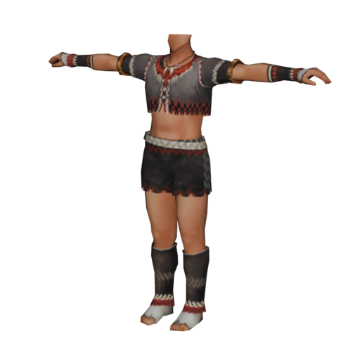](#type-1-1) | [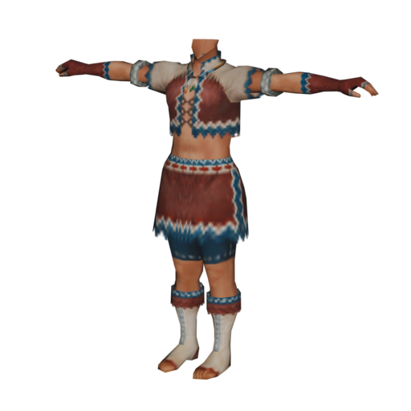](#type-2-1) | [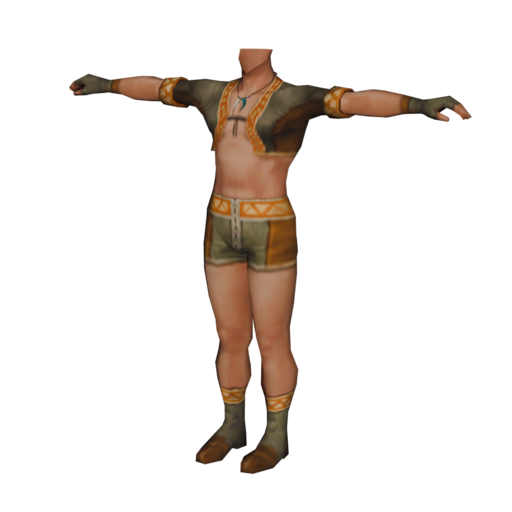](#type-3-1) | [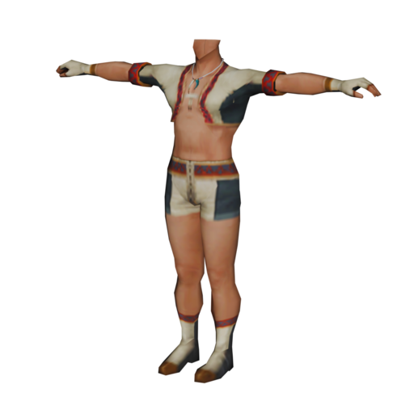](#type-4-1) |
|:---:|:---:|:---:|:---:|
| [Type 1](#type-1-1) | [Type 2](#type-2-1) | [Type 3](#type-3-1) | [Type 4](#type-4-1) |
|  | [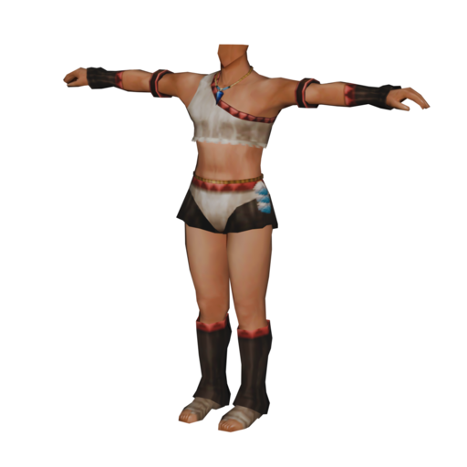](#type-6-1) | [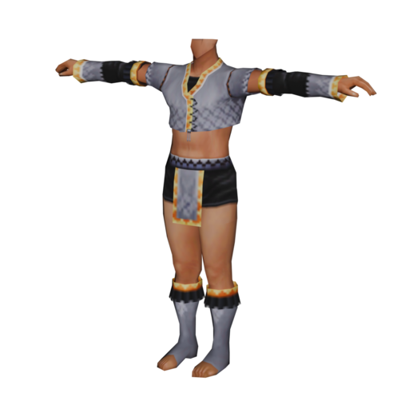](#type-7-1) |  |
| [Type 5](#type-5-1) | [Type 6](#type-6-1) | [Type 7](#type-7-1) | [Type 8](#type-8-1) |

### Type 1
{: .text-yellow-300 .fw-700 .text-center }

<table>
    
    <thead>
    <tr>
        <th style="color:#ffeb82;" colspan="3">Skin Type 1</th>
        <th style="color:#ffeb82;" colspan="3">Skin Type 2</th>
    </tr>
    </thead>
    <tbody>
    <tr>
        <th style="color:#ffeb82;">Type</th>
        <th style="color:#ffeb82;">File ID</th>
        <th style="color:#ffeb82;">File Name</th>
        <th style="color:#ffeb82;">Type</th>
        <th style="color:#ffeb82;">File ID</th>
        <th style="color:#ffeb82;">File Name</th>
    </tr>
    <tr>
        <td>Chest</td>
        <td>2589</td>
        <td>m_body189.pac</td>
        <td>Chest</td>
        <td>2590</td>
        <td>m_body190.pac</td>
    </tr>
    <tr>
        <td>Arm</td>
        <td>1</td>
        <td>.pac</td>
        <td>Arm</td>
        <td>1</td>
        <td>.pac</td>
    </tr>
    <tr>
        <td>Leg</td>
        <td>1</td>
        <td>.pac</td>
        <td>Leg</td>
        <td>1</td>
        <td>.pac</td>
    </tr>
    <tr>
        <th style="color:#ffeb82;" colspan="3">Skin Type 3</th>
        <th style="color:#ffeb82;" colspan="3">Skin Type 4</th>
    </tr>
    <tr>
        <th style="color:#ffeb82;">Type</th>
        <th style="color:#ffeb82;">File ID</th>
        <th style="color:#ffeb82;">File Name</th>
        <th style="color:#ffeb82;">Type</th>
        <th style="color:#ffeb82;">File ID</th>
        <th style="color:#ffeb82;">File Name</th>
    </tr>
    <tr>
        <td>Chest</td>
        <td>2591</td>
        <td>m_body191.pac</td>
        <td>Chest</td>
        <td>2592</td>
        <td>m_body192.pac</td>
    </tr>
    <tr>
        <td>Arm</td>
        <td>1</td>
        <td>.pac</td>
        <td>Arm</td>
        <td>1</td>
        <td>.pac</td>
    </tr>
    <tr>
        <td>Leg</td>
        <td>1</td>
        <td>.pac</td>
        <td>Leg</td>
        <td>1</td>
        <td>.pac</td>
    </tr>
</tbody></table>

### Type 2
{: .text-yellow-300 .fw-700 .text-center }

<table>
    
    <thead>
    <tr>
        <th style="color:#ffeb82;" colspan="3">Skin Type 1</th>
        <th style="color:#ffeb82;" colspan="3">Skin Type 2</th>
    </tr>
    </thead>
    <tbody>
    <tr>
        <th style="color:#ffeb82;">Type</th>
        <th style="color:#ffeb82;">File ID</th>
        <th style="color:#ffeb82;">File Name</th>
        <th style="color:#ffeb82;">Type</th>
        <th style="color:#ffeb82;">File ID</th>
        <th style="color:#ffeb82;">File Name</th>
    </tr>
    <tr>
        <td>Chest</td>
        <td>2593</td>
        <td>m_body193.pac</td>
        <td>Chest</td>
        <td>2594</td>
        <td>m_body194.pac</td>
    </tr>
    <tr>
        <td>Arm</td>
        <td>1</td>
        <td>.pac</td>
        <td>Arm</td>
        <td>1</td>
        <td>.pac</td>
    </tr>
    <tr>
        <td>Leg</td>
        <td>1</td>
        <td>.pac</td>
        <td>Leg</td>
        <td>1</td>
        <td>.pac</td>
    </tr>
    <tr>
        <th style="color:#ffeb82;" colspan="3">Skin Type 3</th>
        <th style="color:#ffeb82;" colspan="3">Skin Type 4</th>
    </tr>
    <tr>
        <th style="color:#ffeb82;">Type</th>
        <th style="color:#ffeb82;">File ID</th>
        <th style="color:#ffeb82;">File Name</th>
        <th style="color:#ffeb82;">Type</th>
        <th style="color:#ffeb82;">File ID</th>
        <th style="color:#ffeb82;">File Name</th>
    </tr>
    <tr>
        <td>Chest</td>
        <td>2595</td>
        <td>m_body195.pac</td>
        <td>Chest</td>
        <td>2596</td>
        <td>m_body196.pac</td>
    </tr>
    <tr>
        <td>Arm</td>
        <td>1</td>
        <td>.pac</td>
        <td>Arm</td>
        <td>1</td>
        <td>.pac</td>
    </tr>
    <tr>
        <td>Leg</td>
        <td>1</td>
        <td>.pac</td>
        <td>Leg</td>
        <td>1</td>
        <td>.pac</td>
    </tr>
</tbody></table>

### Type 3
{: .text-yellow-300 .fw-700 .text-center }

<table>
    
    <thead>
    <tr>
        <th style="color:#ffeb82;" colspan="3">Skin Type 1</th>
        <th style="color:#ffeb82;" colspan="3">Skin Type 2</th>
    </tr>
    </thead>
    <tbody>
    <tr>
        <th style="color:#ffeb82;">Type</th>
        <th style="color:#ffeb82;">File ID</th>
        <th style="color:#ffeb82;">File Name</th>
        <th style="color:#ffeb82;">Type</th>
        <th style="color:#ffeb82;">File ID</th>
        <th style="color:#ffeb82;">File Name</th>
    </tr>
    <tr>
        <td>Chest</td>
        <td>2400</td>
        <td>m_body000.pac</td>
        <td>Chest</td>
        <td>2416</td>
        <td>m_body016.pac</td>
    </tr>
    <tr>
        <td>Arm</td>
        <td>1</td>
        <td>.pac</td>
        <td>Arm</td>
        <td>1</td>
        <td>.pac</td>
    </tr>
    <tr>
        <td>Leg</td>
        <td>1</td>
        <td>.pac</td>
        <td>Leg</td>
        <td>1</td>
        <td>.pac</td>
    </tr>
    <tr>
        <th style="color:#ffeb82;" colspan="3">Skin Type 3</th>
        <th style="color:#ffeb82;" colspan="3">Skin Type 4</th>
    </tr>
    <tr>
        <th style="color:#ffeb82;">Type</th>
        <th style="color:#ffeb82;">File ID</th>
        <th style="color:#ffeb82;">File Name</th>
        <th style="color:#ffeb82;">Type</th>
        <th style="color:#ffeb82;">File ID</th>
        <th style="color:#ffeb82;">File Name</th>
    </tr>
    <tr>
        <td>Chest</td>
        <td>2417</td>
        <td>m_body017.pac</td>
        <td>Chest</td>
        <td>2418</td>
        <td>m_body018.pac</td>
    </tr>
    <tr>
        <td>Arm</td>
        <td>1</td>
        <td>.pac</td>
        <td>Arm</td>
        <td>1</td>
        <td>.pac</td>
    </tr>
    <tr>
        <td>Leg</td>
        <td>1</td>
        <td>.pac</td>
        <td>Leg</td>
        <td>1</td>
        <td>.pac</td>
    </tr>
</tbody></table>

### Type 4
{: .text-yellow-300 .fw-700 .text-center }

<table>
    
    <thead>
    <tr>
        <th style="color:#ffeb82;" colspan="3">Skin Type 1</th>
        <th style="color:#ffeb82;" colspan="3">Skin Type 2</th>
    </tr>
    </thead>
    <tbody>
    <tr>
        <th style="color:#ffeb82;">Type</th>
        <th style="color:#ffeb82;">File ID</th>
        <th style="color:#ffeb82;">File Name</th>
        <th style="color:#ffeb82;">Type</th>
        <th style="color:#ffeb82;">File ID</th>
        <th style="color:#ffeb82;">File Name</th>
    </tr>
    <tr>
        <td>Chest</td>
        <td>2620</td>
        <td>m_body220.pac</td>
        <td>Chest</td>
        <td>2621</td>
        <td>m_body221.pac</td>
    </tr>
    <tr>
        <td>Arm</td>
        <td>1</td>
        <td>.pac</td>
        <td>Arm</td>
        <td>1</td>
        <td>.pac</td>
    </tr>
    <tr>
        <td>Leg</td>
        <td>1</td>
        <td>.pac</td>
        <td>Leg</td>
        <td>1</td>
        <td>.pac</td>
    </tr>
    <tr>
        <th style="color:#ffeb82;" colspan="3">Skin Type 3</th>
        <th style="color:#ffeb82;" colspan="3">Skin Type 4</th>
    </tr>
    <tr>
        <th style="color:#ffeb82;">Type</th>
        <th style="color:#ffeb82;">File ID</th>
        <th style="color:#ffeb82;">File Name</th>
        <th style="color:#ffeb82;">Type</th>
        <th style="color:#ffeb82;">File ID</th>
        <th style="color:#ffeb82;">File Name</th>
    </tr>
    <tr>
        <td>Chest</td>
        <td>2622</td>
        <td>m_body222.pac</td>
        <td>Chest</td>
        <td>2623</td>
        <td>m_body223.pac</td>
    </tr>
    <tr>
        <td>Arm</td>
        <td>1</td>
        <td>.pac</td>
        <td>Arm</td>
        <td>1</td>
        <td>.pac</td>
    </tr>
    <tr>
        <td>Leg</td>
        <td>1</td>
        <td>.pac</td>
        <td>Leg</td>
        <td>1</td>
        <td>.pac</td>
    </tr>
</tbody></table>

### Type 5
{: .text-yellow-300 .fw-700 .text-center }

<table>
    
    <thead>
    <tr>
        <th style="color:#ffeb82;" colspan="3">Skin Type 1</th>
        <th style="color:#ffeb82;" colspan="3">Skin Type 2</th>
    </tr>
    </thead>
    <tbody>
    <tr>
        <th style="color:#ffeb82;">Type</th>
        <th style="color:#ffeb82;">File ID</th>
        <th style="color:#ffeb82;">File Name</th>
        <th style="color:#ffeb82;">Type</th>
        <th style="color:#ffeb82;">File ID</th>
        <th style="color:#ffeb82;">File Name</th>
    </tr>
    <tr>
        <td>Chest</td>
        <td>2654</td>
        <td>m_body254.pac</td>
        <td>Chest</td>
        <td>2653</td>
        <td>m_body253.pac</td>
    </tr>
    <tr>
        <td>Arm</td>
        <td>1</td>
        <td>.pac</td>
        <td>Arm</td>
        <td>1</td>
        <td>.pac</td>
    </tr>
    <tr>
        <td>Leg</td>
        <td>1</td>
        <td>.pac</td>
        <td>Leg</td>
        <td>1</td>
        <td>.pac</td>
    </tr>
    <tr>
        <th style="color:#ffeb82;" colspan="3">Skin Type 3</th>
        <th style="color:#ffeb82;" colspan="3">Skin Type 4</th>
    </tr>
    <tr>
        <th style="color:#ffeb82;">Type</th>
        <th style="color:#ffeb82;">File ID</th>
        <th style="color:#ffeb82;">File Name</th>
        <th style="color:#ffeb82;">Type</th>
        <th style="color:#ffeb82;">File ID</th>
        <th style="color:#ffeb82;">File Name</th>
    </tr>
    <tr>
        <td>Chest</td>
        <td>2652</td>
        <td>m_body252.pac</td>
        <td>Chest</td>
        <td>2651</td>
        <td>m_body251.pac</td>
    </tr>
    <tr>
        <td>Arm</td>
        <td>1</td>
        <td>.pac</td>
        <td>Arm</td>
        <td>1</td>
        <td>.pac</td>
    </tr>
    <tr>
        <td>Leg</td>
        <td>1</td>
        <td>.pac</td>
        <td>Leg</td>
        <td>1</td>
        <td>.pac</td>
    </tr>
</tbody></table>

### Type 6
{: .text-yellow-300 .fw-700 .text-center }

<table>
    
    <thead>
    <tr>
        <th style="color:#ffeb82;" colspan="3">Skin Type 1</th>
        <th style="color:#ffeb82;" colspan="3">Skin Type 2</th>
    </tr>
    </thead>
    <tbody>
    <tr>
        <th style="color:#ffeb82;">Type</th>
        <th style="color:#ffeb82;">File ID</th>
        <th style="color:#ffeb82;">File Name</th>
        <th style="color:#ffeb82;">Type</th>
        <th style="color:#ffeb82;">File ID</th>
        <th style="color:#ffeb82;">File Name</th>
    </tr>
    <tr>
        <td>Chest</td>
        <td>2658</td>
        <td>m_body258.pac</td>
        <td>Chest</td>
        <td>2657</td>
        <td>m_body257.pac</td>
    </tr>
    <tr>
        <td>Arm</td>
        <td>1</td>
        <td>.pac</td>
        <td>Arm</td>
        <td>1</td>
        <td>.pac</td>
    </tr>
    <tr>
        <td>Leg</td>
        <td>1</td>
        <td>.pac</td>
        <td>Leg</td>
        <td>1</td>
        <td>.pac</td>
    </tr>
    <tr>
        <th style="color:#ffeb82;" colspan="3">Skin Type 3</th>
        <th style="color:#ffeb82;" colspan="3">Skin Type 4</th>
    </tr>
    <tr>
        <th style="color:#ffeb82;">Type</th>
        <th style="color:#ffeb82;">File ID</th>
        <th style="color:#ffeb82;">File Name</th>
        <th style="color:#ffeb82;">Type</th>
        <th style="color:#ffeb82;">File ID</th>
        <th style="color:#ffeb82;">File Name</th>
    </tr>
    <tr>
        <td>Chest</td>
        <td>2656</td>
        <td>m_body256.pac</td>
        <td>Chest</td>
        <td>2655</td>
        <td>m_body255.pac</td>
    </tr>
    <tr>
        <td>Arm</td>
        <td>1</td>
        <td>.pac</td>
        <td>Arm</td>
        <td>1</td>
        <td>.pac</td>
    </tr>
    <tr>
        <td>Leg</td>
        <td>1</td>
        <td>.pac</td>
        <td>Leg</td>
        <td>1</td>
        <td>.pac</td>
    </tr>
</tbody></table>

### Type 7
{: .text-yellow-300 .fw-700 .text-center }

<table>
    
    <thead>
    <tr>
        <th style="color:#ffeb82;" colspan="3">Skin Type 1</th>
        <th style="color:#ffeb82;" colspan="3">Skin Type 2</th>
    </tr>
    </thead>
    <tbody>
    <tr>
        <th style="color:#ffeb82;">Type</th>
        <th style="color:#ffeb82;">File ID</th>
        <th style="color:#ffeb82;">File Name</th>
        <th style="color:#ffeb82;">Type</th>
        <th style="color:#ffeb82;">File ID</th>
        <th style="color:#ffeb82;">File Name</th>
    </tr>
    <tr>
        <td>Chest</td>
        <td>2662</td>
        <td>m_body262.pac</td>
        <td>Chest</td>
        <td>2661</td>
        <td>m_body261.pac</td>
    </tr>
    <tr>
        <td>Arm</td>
        <td>1</td>
        <td>.pac</td>
        <td>Arm</td>
        <td>1</td>
        <td>.pac</td>
    </tr>
    <tr>
        <td>Leg</td>
        <td>1</td>
        <td>.pac</td>
        <td>Leg</td>
        <td>1</td>
        <td>.pac</td>
    </tr>
    <tr>
        <th style="color:#ffeb82;" colspan="3">Skin Type 3</th>
        <th style="color:#ffeb82;" colspan="3">Skin Type 4</th>
    </tr>
    <tr>
        <th style="color:#ffeb82;">Type</th>
        <th style="color:#ffeb82;">File ID</th>
        <th style="color:#ffeb82;">File Name</th>
        <th style="color:#ffeb82;">Type</th>
        <th style="color:#ffeb82;">File ID</th>
        <th style="color:#ffeb82;">File Name</th>
    </tr>
    <tr>
        <td>Chest</td>
        <td>2660</td>
        <td>m_body260.pac</td>
        <td>Chest</td>
        <td>2659</td>
        <td>m_body259.pac</td>
    </tr>
    <tr>
        <td>Arm</td>
        <td>1</td>
        <td>.pac</td>
        <td>Arm</td>
        <td>1</td>
        <td>.pac</td>
    </tr>
    <tr>
        <td>Leg</td>
        <td>1</td>
        <td>.pac</td>
        <td>Leg</td>
        <td>1</td>
        <td>.pac</td>
    </tr>
</tbody></table>

### Type 8
{: .text-yellow-300 .fw-700 .text-center }

<table>
    
    <thead>
    <tr>
        <th style="color:#ffeb82;" colspan="3">Skin Type 1</th>
        <th style="color:#ffeb82;" colspan="3">Skin Type 2</th>
    </tr>
    </thead>
    <tbody>
    <tr>
        <th style="color:#ffeb82;">Type</th>
        <th style="color:#ffeb82;">File ID</th>
        <th style="color:#ffeb82;">File Name</th>
        <th style="color:#ffeb82;">Type</th>
        <th style="color:#ffeb82;">File ID</th>
        <th style="color:#ffeb82;">File Name</th>
    </tr>
    <tr>
        <td>Chest</td>
        <td>2666</td>
        <td>m_body266.pac</td>
        <td>Chest</td>
        <td>2665</td>
        <td>m_body265.pac</td>
    </tr>
    <tr>
        <td>Arm</td>
        <td>1</td>
        <td>.pac</td>
        <td>Arm</td>
        <td>1</td>
        <td>.pac</td>
    </tr>
    <tr>
        <td>Leg</td>
        <td>1</td>
        <td>.pac</td>
        <td>Leg</td>
        <td>1</td>
        <td>.pac</td>
    </tr>
    <tr>
        <th style="color:#ffeb82;" colspan="3">Skin Type 3</th>
        <th style="color:#ffeb82;" colspan="3">Skin Type 4</th>
    </tr>
    <tr>
        <th style="color:#ffeb82;">Type</th>
        <th style="color:#ffeb82;">File ID</th>
        <th style="color:#ffeb82;">File Name</th>
        <th style="color:#ffeb82;">Type</th>
        <th style="color:#ffeb82;">File ID</th>
        <th style="color:#ffeb82;">File Name</th>
    </tr>
    <tr>
        <td>Chest</td>
        <td>2664</td>
        <td>m_body264.pac</td>
        <td>Chest</td>
        <td>2663</td>
        <td>m_body263.pac</td>
    </tr>
    <tr>
        <td>Arm</td>
        <td>1</td>
        <td>.pac</td>
        <td>Arm</td>
        <td>1</td>
        <td>.pac</td>
    </tr>
    <tr>
        <td>Leg</td>
        <td>1</td>
        <td>.pac</td>
        <td>Leg</td>
        <td>1</td>
        <td>.pac</td>
    </tr>
</tbody></table>
