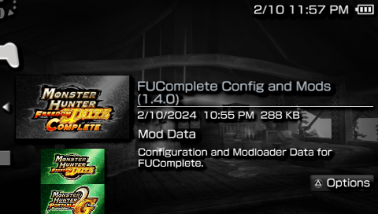

{: .text-center }

# *What is FUComplete?*
{: .text-yellow-300 .fw-500 .text-center .fs-7 .lh-default }

**FUComplete**{: .text-yellow-300 } is a modification of the game **Monster Hunter Portable 2nd G** *(Japanese version of **Monster Hunter Freedom Unite**)*, aiming to be feature complete and add new features to the game while also maintaining crossplay with vanilla players. It also not only works on emulators but also on real hardware like the PSP or Vita.

### Features:
{: .text-yellow-300 .fw-700 .lh-default }

* MHFU localization ported over and Japanese exclusive content translated to English.
* Able to load any region save without a need to convert.
* All 38 events and 14 challenges are integrated into the game.
* Increased limit on quests in savedata from 6 to 18.
* In-game toggle to switch between built-in (official) events and savedata (custom) quests.
* Modloader support, which makes updating and modding the game easier.
* Configuration file support so you can enable/disable/tweak the features you want.
* Various QoL features such as:
  - Minimap Scale
  - Full chest access in Guildhall (Offline)
  - Adjustable Field of View
  - Faster pickup from supply chests
  - Hold to carve/gather
  - ...and more!

### Screenshots:
{: .text-yellow-300 .fw-700 .lh-default }

<!-- 
{: .d-flex .flex-justify-around .d-inline } -->

{: .d-flex .flex-justify-around }

{: .d-flex .flex-justify-around }

<!-- ---

# *What's Changed?*
{: .text-yellow-300 .fw-500 .text-center .fs-7 .lh-default }

### <ins>FUCTool:</ins>

A new program called `FUCTool` is bundled with the patch to handle various aspects such as patching, updating the configuration file, setting up file replacer and injecting quests. To know more on how to use it please see the [FUCTool](https://github.com/FUComplete/FUCTool) repo.

### <ins>Configuration:</ins>

`CONFIG.BIN` is the configuration file loaded by the game to set specific features of the patch, these options are:

* File replacer
* Save region
* True raw/element/status display
* Dos audio
* Field of view (FoV)
* Vertical snap start position
* Minimap scale
* Hunting Horn tweak
* Early kill Lao/Shen (Fortress)
* Guildhall Full Chest (Offline)
* Guildhall Drink Buff

### <ins>File Replacer:</ins>

File replacer, as its name implies, lets you replace individual files in the game that are stored in `ms0:/PSP/SAVEDATA/FUCDAT/NATIVEPSP`. Think of it like MHWs `nativePC` implementation.

Please refer to the [FUCTool](https://github.com/FUComplete/FUCTool) repo for more information on how to set it up.

### <ins>Changes:</ins>

_**Quality of Life**_
* The 38 events and 14 challenges are now built into the game. Savedata quest store limit has been raised to 18, up from 6.
* The option to toggle Data Install now has a new function: It now switches between the integrated event quests and any quests added to Savedata.
* The option to toggle Background Loading now has a new function: Can turn ON/OFF File Replacer.
* All Bonus DLC are enabled by default.
* Easily switch between what region save to load ***(optional/config)***.
* Auto equipment previews in shops enabled by default without the requirement of a data install.
* Faster pickup speed from supply chests.
* Able to buy in bulk to chest the Binoculars, Powercharm, Armorcharm and BBQ Spit. Useful for decoration crafting.
* You can now change your equipment in the Gathering Hall ***(optional/config)***.
* Status display settings (the settings for enabling/disabling HUD in quest) are now persistent between quests.
* Guildhall table now has a "drink buff" - This means you can get a quick boost to Health and Stamina without leaving the Gathering Hall, based on how many Felyne Chefs you have working in your kitchen. Press 'Circle' to activate while sitting at the table ***(optional/config)***.
  - For each active chef in your kitchen, receive +10 max HP (max +50 at 5 chefs).
  - For 1-4 active chefs in your kitchen, receive +25 max Stamina (max +50 at 5 chefs).
* Display true raw/element/status of weapons ***(optional/config)***.
* Adjust field of view value ***(optional/config)***.
* Set starting vertical camera position ***(optional/config)***.
* Adjust minimap scale ***(optional/config)***.
* Able to gather/carve continuously by holding the button.

_**Gameplay/Mechanic**_
* Any quest with Lao-Shan Lung, Ash Lao-Shan Lung or Shen Gaoren on Fortress have their HP thresholds removed, allowing for a pre area 5 kill. ***(optional/config)***
* Hunting Horn tweaks ***(optional/config)*** rework the weapon slightly to make it more approachable and rebuff it back to P2/F2 levels.
  - Note mechanics work similar to Frontier, where notes only clear if you sheath your weapon or have a forced sheathed interaction.
  - Left and right swing MV/KO values increased to match P2/F2 values. 31 MV and 18 KO, up from 27 MV and 15 KO.
  - Hilt jab poke attack now does cutting damage instead of impact.
  
_**General/Other**_
* Fixed various localization errors and updated menus to match.
* Increased draw distance of NPCs in village.
* Adjusted item wheel to match FU
* Sharpness indicator and glow now uniform and fixed.
* Fixed draw region of the "!" sprite to display properly.
* Felyne on guildcard no longer has melynx ears.
* Bowgun shells in HUD are now correctly aligned.
* Guildcard elements fixed to avoid string overflows and better alignment.
* Guildhall Shop NPC position fixed, feet no longer clip through the floor and now has a shadow.
* Wandering Chef NPC position fixed, no longer floats in the air and is more visible on game start.
* Dummied strings for non-monsters now display properly when using HPD hack.
* ICON0 updated so you can easily tell the difference between patched/unpatched.
* Use Dos battle themes instead of the default ones ***(optional/config)***. -->
